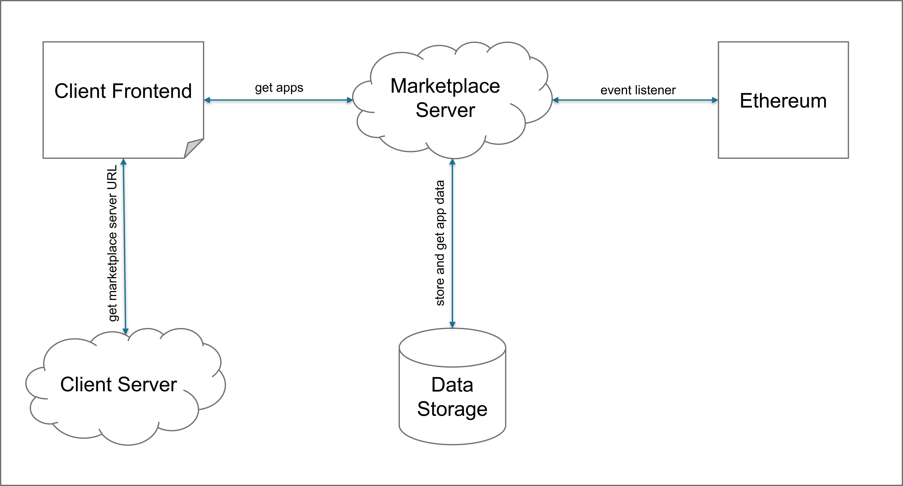
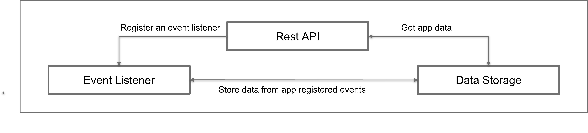
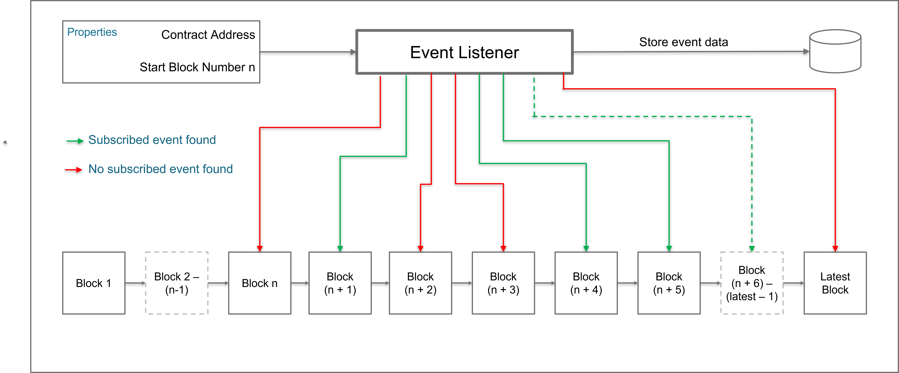

# Marketplace Server

## What is this?
This project was developed as a prototype in the scope of a master thesis with the topic "Concept and Design of an efficient search and discovery mechanism in decentralized ledger-based marketplaces". 

Goal of this prototype is to provide a solution for a search mechanism that can be used to query blockchain (especially Ethereum) data. Querying data from Ethereum is not efficiently  possible in the standard setup. This is because of the structure of a blockchain. Each block only knows about it's parents block by a hash value, as the blockchain ist a chain of blocks with unique hash identifiers. 
Searching for elements within the blockchain would therefore require knowing the exact hash of the block where the wanted information is stored in or iterating through the whole blockchain until the information is found. 
As this a very unefficient procedure and not very user friendly, this prototype provides a solution with an in-between service. 

## Architecture 


The Marketplace Server is the interface between the client application and the Ethereum blockchain.
Therefore it combines multiple tasks in one system that all communicate with each other to achieve a searchable data index of the contracts event data. The server should provide following functionalities which are illustrated in Figure 3.6.
- an event listener that communicates with the Ethereum blockchain and listens for the
defined events and processes their data
- a connection to the data storage that is able to write data into and query data from the
connected database
- a Rest API to provide an interface for other applications


### Event Listener

The event listener in the Marketplace Server is registered on start-up of the application and additionally can be re-triggered with a POST request to the REST API in case any failure happens. Within the applications properties, the smart contract address and the first block number to listen to must be defined. The first block number should be the block where the smart contract was deployed. This is, because before the deployment the smart contract can not have emitted any events. Furthermore, by not starting at the root block in the blockchain, a lot of execution time is saved when the event listener is initialized first. Once the event listener is registered, it starts to go through the blocks beginning with the defined starting block and looks for any of the emitted events, until the latest registered block. Once all recent blocks are processed, the event listener is subscribed to the following blocks. When a block is added to the Ethereum node, the event listener checks if transactions in the block contain the subscribed events, if they are not included, the block is ignored, but if they are included, the data is extracted and stored in a database. The events AppRegisteredEvent, AppNameRegisteredEvent,
AppVersionRegisteredEvent, AppSetOwnerEvent and AppVersionURLSetEvent are
subscribed separately. To identify whether the event belongs to the same app, they all have a unique appID.



### Database

The MongoDB stores entries of the Blade registered apps. The apps have the same properties as in the Blade Registry, which are appID, appName, appURL, appOwnerID and appVersionID.
The field appName is indexed to function inside of the full-text search. The appID is the unique ID of each Blade app entity. Therefore, the elements can be accessed and updated via their appID. Within the MongoDBService implementation, app entities can be created and updated, a list of all apps can be queried or a full-text query can be performed.

### REST API

The REST API is the interface between the User or a Service and the Marketplace Server. The endpoints provided are 
- POST /blade/marketplapce/register-event-listener/
- GET /blade/marketplace/apps/all
- GET /blade/marketplace/apps/\<query\>

## Technology

In general the Marketplace Server is implemented in Java 113 using Spring Boot, as it provides a convenient and easy way to create stand-alone applications. To handle dependencies, install libraries, build and run the project Maven5 is used. To be able to connect to an Ethereum node and interact with smart contracts, the Android and Java library Web3j6 is used. MongoDB is used as database architecture. The connected Ethereum node is a Go Ethereum (Geth) implementation. The node is running as a light node, because the light Geth node takes up much less storage capacity of the device. This is because the light node only stores the headers of the blocks in the chain and only requests more information once needed. The downside of running a light Geth node though, is that there are much less peers available to connect to, which implies a long start-up time until a peer is found in many cases. Unfortunately, Infura nodes can not be used to connect the Marketplace server to, as they do not support the usage of Web3j filters, which are used to enable the event listening.
To start the application in a convenient way, suitable for every environment, the Geth node, the Marketplace Spring Boot server and the MongoDB database each are configured in a Docker container and connected via Docker Compose.

## Setup & Installation
To start the service, you need to install [Docker Compose](https://docs.docker.com/compose/).
Docker compose handles the connection between the three different components, the marketplace server, the mongoDB database and the geth node. 
To start the service with docker compose simply run 
```
docker-compose up
```
You can add the "-d" option to run the containers detached or use a screen session on linux based systems.
After the container started it might need a while until the geth node finds any peers to connect to and starts the synchronization of the blockchain. 

To enable the indexing functionality in the mongoDB database, you need to attach to the mongoDB container, execute the running database console  and create the index by running the command 
```
docker exec -it contractlistener_mongo_db_1 mongo
use blade-registry
db.bladeApp.createIndex({appName:"text"})
```

## Ethereum ropsten net merge

Because of a merge in the ropsten testnet in Ethereum, the used chain was changed to rinkeby. Further information to the merge can be read in the links below.

https://decrypt.co/102320/ethereum-merge-ropsten-live
https://blog.ethereum.org/2022/05/30/ropsten-merge-announcement/
https://blog.ethereum.org/2022/06/03/ropsten-merge-ttd/

